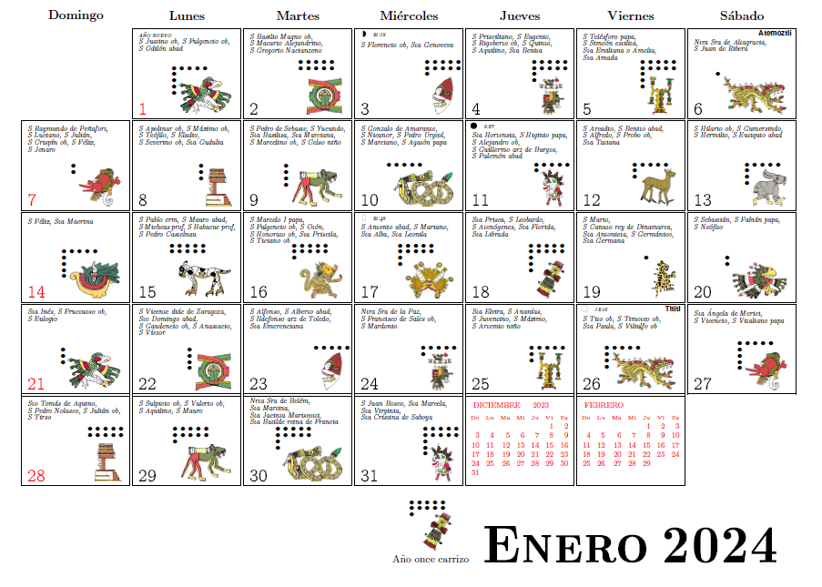

# Relación entre los calendarios gregoriano y azteca



Las fases de la luna, semana santa y días festivos se tienen que actualizar cada año,
aunque en la versión de HTML y javascript sí se calculan automáticamente
([véase aquí](https://www.uaq.mx/ingenieria/publicaciones/calendarios/calazt.html))

En el archivo azteca.pdf se explica más ampliamente.

```
El archivo calazt.tex lo incluyo por cuestión histórica... créo que el uso de \special
ya no funciona (al menos como está escrito en este programa).
```
